# Avengers Assemble User Guide

Avengers Assemble (AA) is a **desktop app for managing contacts**, meant for use with a Command Line Interface (CLI)
while still having the benefits of a Graphical User Interface (GUI).

The application is designed for **Head Tutors** of the NUS CS1101S Programming Methodology course, who intend to simplify their administrative tasks relating to contact management between students, other teaching assistants, and course instructors.

This user guide provides a comprehensive overview of the Avengers Assemble's features and functionalities, and aims to guide you through its setup and usage. We will walk you through each feature in a structured manner:

1. Installation,
2. Basic commands like adding and editing, and
3. Advanced commands like filtering and exporting of data.

By following this guide, you will be able to gain a thorough understanding of Avengers Assemble and maximize its potential to streamline your administrative tasks.

--------------------------------------------------------------------------------------------------------------------

<!-- * Table of Contents -->
## Table of Contents

Click below to navigate the user guide:

<div id="table-of-contents" style="line-height: 2.0">
<ol>
    <li><a href="#quick-start">Quick Start</a></li>
    <li><a href="#outline">Outline of Application</a></li>
    <li><a href="#contact-management-features">Contact Management Features</a></li>
    <ul>
        <li><a href="#help">Getting Help: <code>help</code></a></li>
        <li><a href="#clear">Clearing All Entries: <code>clear</code></a></li>
        <li><a href="#import">Importing Persons from a CSV File: <code>import</code></a></li>
        <li><a href="#add">Adding a Person: <code>add</code></a></li>
        <li><a href="#edit">Editing a Person: <code>edit</code></a></li>
        <li><a href="#delete">Deleting a Person: <code>delete</code></a></li>
        <li><a href="#deleteshown">Deleting Filtered Persons: <code>deleteShown</code></a></li>
        <li><a href="#list">Listing All Persons: <code>list</code></a></li>
        <li><a href="#find">Filtering Persons: <code>find</code></a></li>
        <li><a href="#copy">Filtering Persons: <code>copy</code></a></li>
        <li><a href="#export">Exporting Data to a CSV File: <code>export</code></a></li>
        <li><a href="#exit">Exiting the Program: <code>exit</code></a></li>
    </ul>
    <li><a href="#exam-management-features">Exam Management Features</a></li>
    <ul>
        <li><a href="#importexamscores">Importing Exam Scores from a CSV File: <code>importExamScores</code></a></li>
        <li><a href="#addexam">Adding an Exam: <code>addExam</code></a></li>
        <li><a href="#deleteexam">Deleting an Exam: <code>deleteExam</code></a></li>
        <li><a href="#selectexam">Selecting an Exam: <code>selectExam</code></a></li>
        <li><a href="#deselectexam">Deselecting an Exam: <code>deselectExam</code></a></li>
        <li><a href="#addscore">Adding an Exam Score: <code>addScore</code></a></li>
        <li><a href="#editscore">Editing an Exam Score: <code>editScore</code></a></li>
        <li><a href="#deletescore">Deleting an Exam Score: <code>deleteScore</code></a></li>
        <li><a href="#mean-and-median">Mean and Median of Exam Scores</a></li>
    </ul>
    <li><a href="#additional-information">Additional Information</a></li>
    <li><a href="#faq">FAQ</a></li>
    <li><a href="#known-issues">Known Issues</a></li>
    <li><a href="#command-summary">Command Summary</a></li>
    <li><a href="#command-parameter-summary">Command Parameter Summary</a></li>
</ol>
</div>

<div style="page-break-after: always;"></div>

--------------------------------------------------------------------------------------------------------------------

<div id="quick-start"></div>

## Quick Start

1. Ensure you have `Java 11` or above installed in your computer.

2. Download the latest `avengersassemble.jar` [here](https://github.com/AY2324S2-CS2103T-T10-1/tp/releases).

3. Copy the file to the folder you want to use as the _home folder_ for our application.

4. Open a command terminal, `cd` into the folder you put the jar file in, and use the `java -jar avengersassemble.jar` command to run the application.<br>
   ```dtd
    cd <path_to_the_folder_containing_the_jar_file>
    java -jar avengersassemble.jar
    ```
   You should see this when the app starts up. Note how it contains some sample data.<br>

<p align="center">
    
</p>

5. Refer to the [features](#contact-management-features) below for details of each command.

<br>

--------------------------------------------------------------------------------------------------------------------

<div style="page-break-after: always;"></div>

<div id="outline"></div>

## Outline of Application

The image below shows the outline of the application, with the main sections highlighted:

<p align="center">
    

</p>

The main sections are as follows:

1. **Command Input Box**:
   * This is where you can type your commands.
   * Press `Enter` to execute the command.
2. **Results Box**:
    * This area displays the results of the commands you have executed.
    * It will also display any error messages if the command was not executed successfully.
3. **Persons Display Panel**:
   * This area displays the list of persons that you have imported or saved into our application.
   * Each persons is displayed with an index number, name, email, phone number, address, and tags.
   * Each person is also displayed with their matriculation number, studio group, and reflection group if they have been added.
   * If an exam is selected, the person's score for that exam will also be displayed if it exists.
4. **Exams Display Panel**:
   * This area displays the list of exams that you have added into our application.
   * Each exam is displayed with an index number, name, and maximum score.
   * Selected exams will be highlighted in the list.

--------------------------------------------------------------------------------------------------------------------

<div style="page-break-after: always;"></div>

<div id="contact-management-features"></div>

## Contact Management Features

These features are designed to help you manage your contacts effectively and centralizes all contact information in one place.
You can import contacts from CSV files generated by external sources such as canvas and edurec, manage the contact details of each person in your contact list, and export relevant data as CSV files.

### Legend
These boxes might offer you additional information of different types:

>**Good to know:**
>Provides you with supporting information.

<box type="info" seamless>

**Important:**
Provides you with more important information that you should know.
</box>

<box type="tip" seamless>

**Tip:**
Provides you with tips to use our app more effectively.

</box>

<box type="warning" seamless>

**Caution:**
Provides you with warnings about potential issues you might face.

</box>

<br>

<div id="help"></div>

### Getting Help : `help`

Copies the link of our user guide to your clipboard. Paste it into a browser to view it.

**Format:** `help`

You will see this message when you have successfully copied the link.

<p align="center">
  
</p>

<div style="page-break-after: always;"></div>

Before we proceed with the commands, here are some important points to note on their formatting. These points will also be repeated in the [command parameter summary](#command-parameter-summary) for you to refer to easily at any point in time.

<box type="info" seamless>

**Important:** </br>

* Words in `UPPER_CASE` are the parameters to be supplied by you.
  > e.g. in `add n|NAME`, `NAME` is a parameter which can be used as `add n|John Doe`.

* Prefixes encased with '[ ]' are optional.
  > e.g. `n|NAME [t|TAG]` can be used as `n|John Doe t|friend` or as `n|John Doe`.

* Prefixes with '…' after them can be used multiple times.
  > e.g. `[t|TAG]…​` can be used as ` ` (i.e. 0 times), `t|friend` (i.e 1 time), `t|friend t|family` etc.

* Parameters can be in any order.<br>
  > e.g. if the command specifies `n|NAME p|PHONE_NUMBER`, `p|PHONE_NUMBER n|NAME` is also acceptable.

* Extraneous parameters for commands that do not take in parameters (such as `help` , `list`, `exit`, `copy`, `export` and `clear`) will be ignored.<br>
  > e.g. if the command specifies `help 123`, it will be interpreted as `help`.

</box>

<box type="warning" seamless>

**Caution:** <br>
* If you are using a PDF version of this document, be careful when copying and pasting commands that span multiple lines as space characters surrounding line-breaks may be omitted when copied over to the application.

</box>

<br>

<div id="clear"></div>

### Clearing All Entries : `clear`

Deletes **all** entries from your contact list.

**Format:** `clear`

<box type="warning" seamless>

**Caution:**<br>
Using clear will delete all data in an irreversible manner. Be sure to back up your relevant data by using the `export` command before using this command.

</box>

<br>

<div style="page-break-after: always;"></div>

<div id="import"></div>

### Importing Persons from a CSV File : `import`

Imports all persons and their details from a CSV file of your specification.

**Format:** `import i|FILEPATH`

<box type="info" seamless>

**Important:**<br>

* The file path should be **absolute**.
* This command will only import persons' particulars. To import exam scores, take a look at [`importExamScores`](#importing-exam-scores-from-a-csv-file--importexamscores).
* All compulsory parameters **must** be present in the column headings (i.e. the first row) of the CSV file you are importing i.e. `name`, `email`, `phone` and `address`.
* Only values under accepted column headings are read i.e. `name`, `email`, `phone`, `address`, `tags`, `matric`, `reflection` and `studio`
* The number of headers must match the number of cells for each row.
* Invalid rows will be skipped and will not be imported!

</box>

**Example:** `import i|/Users/johansoo/Desktop/AvengersAssemble/exam_data.csv` <br>
imports the data from the CSV file located at `/Users/johansoo/Desktop/AvengersAssemble/exam_data.csv`

You will see this message once you successfully imported the data, with the app showing the details of the imported persons:

<p align="center">
  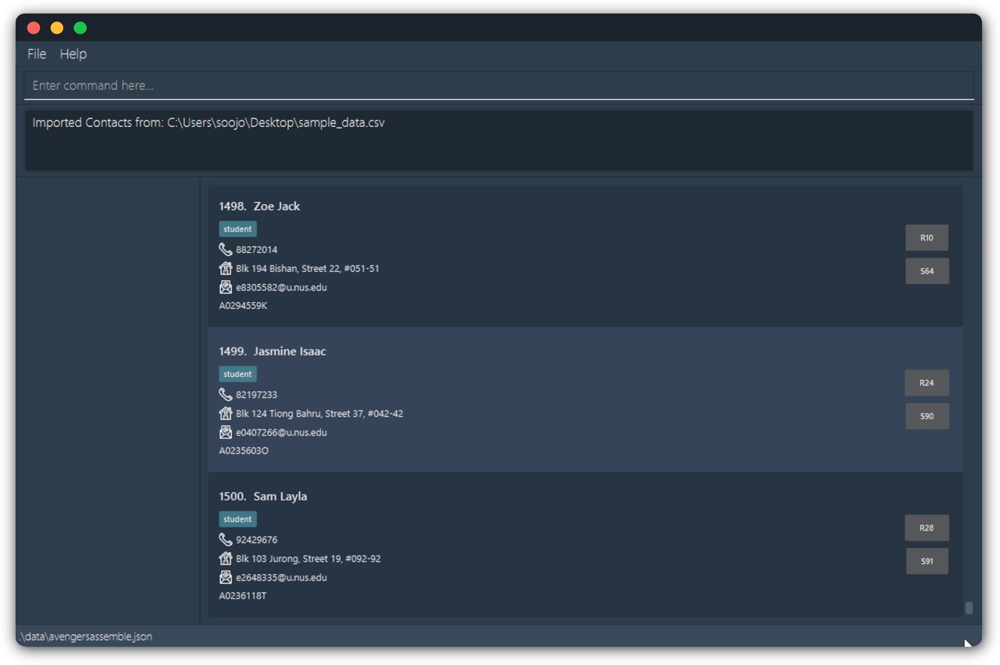
</p>

For more details on the input parameter, [click here](#command-parameter-summary).

<br>

<div style="page-break-after: always;"></div>

<div id="add"></div>

### Adding a Person : `add`

Adds a person to your contact list. The person's details are now stored in the application.

**Format:** `add n|NAME p|PHONE_NUMBER e|EMAIL a|ADDRESS [t|TAG]… [m|MATRICULATION_NUMBER] [s|STUDIO] [r|REFLECTION]​`

<box type="info" seamless>

**Important:**

Each person should have a unique email address. Avengers Assemble does not allow for duplicate email addresses to be added.

</box>

<box type="tip" seamless>

**Tip:**

A person can have any number of tags (including 0)

</box>

> **Note:**
> For your convenience, a `student` tag will automatically be added to a contact if they are added with a matriculation number.
> You are free to edit or remove the tags after the person is added with the [`edit`](#editing-a-person--edit) command.
> For example, a student TA can be added with the `student` tag, and then the `TA` tag can be added to indicate that they are a TA.

**Example:**
`add n|John Doe p|98765432 e|johnd@example.com a|John street, block 123, #01-01 m|A1234567Z s|S1 r|R2`<br>
adds a contact John Doe with the respective phone number, email and physical addresses, matriculation number, studio group and reflection group.

You will see this message once you have successfully added a person, indicating their details:

<p align="center">
  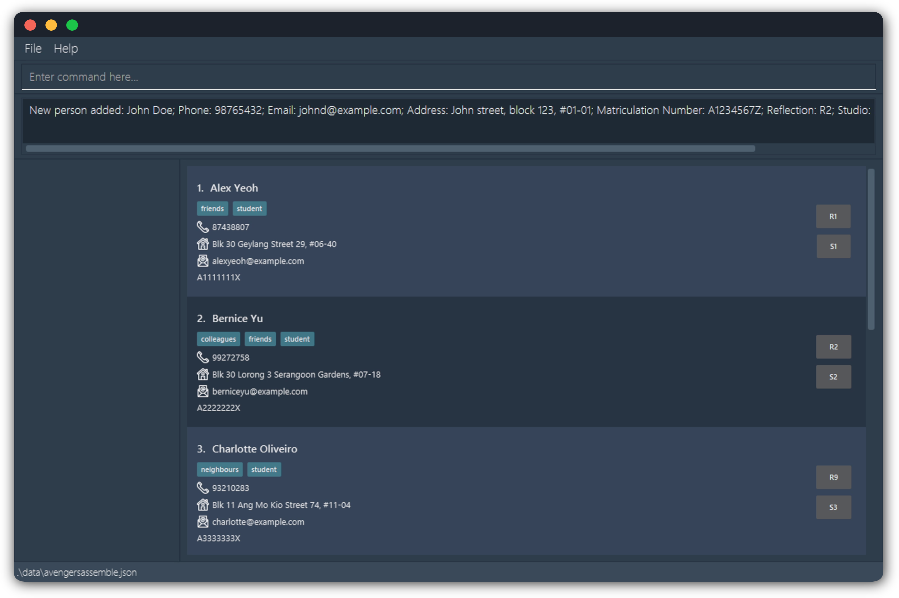
</p>

For more details on each parameter, [click here](#command-parameter-summary).

<br>

<div style="page-break-after: always;"></div>

<div id="edit"></div>

### Editing a Person : `edit`

Edits the details of an existing person in your contact list.

**Format:** `edit INDEX [n|NAME] [p|PHONE] [e|EMAIL] [a|ADDRESS] [t|TAG]… [m|MATRICULATION_NUMBER] [s|STUDIO] [r|REFLECTION]​`

<box type="info" seamless>

**Information:** <br>
* The person at the specified `INDEX` will be edited. The index **must be a positive integer** (1, 2, 3, …)​.
* At least one of the optional fields must be provided.
* Existing values will be updated to the new values.
* Editing tags will replace all existing tags i.e. adding of tags is **not cumulative**.
* You can remove optional fields by typing `t|`, `m|`, `r|` or `s|` respectively without any values.

</box>

<box type="info" seamless>

**Important:**

Updating a matriculation number, studio, or reflection field will not automatically update the tags of the person. You will need to manually update the tags if necessary.

</box>

**Examples:**

1. `edit 2 n|Betsy Crower t|`:
   * Edits the name of the second person to be `Betsy Crower` and clears all existing tags.

<br>

2. `edit 1 p|91234567 e|johndoe@example.com`:
   * Edits the phone number and email address of the first person to be `91234567` and `johndoe@example.com` respectively.

You will see this message once you have successfully edited a person, indicating their updated details:

<p align="center">
  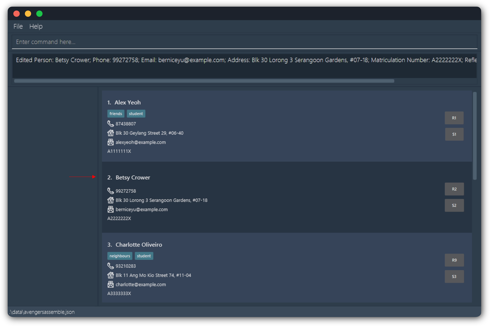
</p>

For more details on each parameter, [click here](#command-parameter-summary).

<br>

<div style="page-break-after: always;"></div>

<div id="delete"></div>

### Deleting a Person : `delete`

Deletes the specified person from your contact list.

**Format:** `delete INDEX`

<box type="info" seamless>

**Important:** <br>

The person at the specified `INDEX` will be deleted. The index **must be a positive integer** (1, 2, 3, …)​

</box>

**Examples**:

1. `find n|Betsy` followed by `delete 1` deletes the first person in the results of the `find` command.
2. `list` followed by `delete 1` deletes the first person stored in the app.

You will see this message once you successfully delete a person from your list, indicating the details of the deleted person:

<p align="center">
  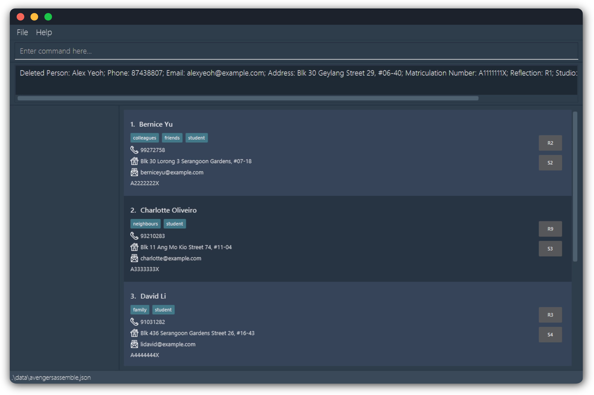
</p>

<br>

<div style="page-break-after: always;"></div>

<div id="deleteshown"></div>

### Deleting Filtered Persons : `deleteShown`

Deletes the current filtered list of persons. Requires a [`find`](#filtering-persons--find) command to be run first.

**Format:** `deleteShown`

<box type="info" seamless>

**Information:**

* Deletes all persons in the current filtered list of persons.
* The list of persons is filtered using the most recent [`find`](#filtering-persons--find) command.
* The remaining list of persons is shown after the [`list`](#listing-all-persons--list) command is executed.

</box>

> **Note:** The application ignores any extraneous parameters as we assume they are typos.

You will see this message once you have successfully deleted the shown persons from your list.

<p align="center">
  
</p>

<br>

<div style="page-break-after: always;"></div>

<div id="list"></div>

### Listing All Persons : `list`

Displays all the persons in your contact list.

**Format:** `list`

> **Note:** The application ignores any extraneous parameters as we assume they are typos.

You will see this message once you have successfully listed all contacts, with the app showing all existing persons in the contact list:

<p align="center">
  
</p>

<br>

<div style="page-break-after: always;"></div>

<div id="find"></div>

### Filtering Persons : `find`

Filters your contacts based on specific criteria you set.

**Format:** `find PREFIX|KEYWORD`

<box type="info" seamless>

**Information:** <br>
* Use this command to search for persons using a specific aspect of their details, as specified by the prefix.
* The search will return any result that contains the keyword you have specified or matches the condition provided by the user.
    > e.g. `find e|john` will find any person that contains `john` in their email. <br>
    > e.g. `find lt|50` will find any person who scored lower than 50 marks for the selected exam. <br/>
    > e.g. `find mt|80.55` will find any person who scored more than 80.55 marks for the selected exam.
* The search is **case-insensitive**.
* Only one prefix can be used at a time.

</box>

<box type="info" seamless>

**Important: An exam must be selected for this command to work with the `lt|` and `mt|` prefixes!
You can use the [`selectExam`](#selecting-an-exam--selectexam) command to do so.**

</box>

**Example:** `find n|John` <br>
returns `john` and `John Doe` if they exist in your contact book.

You will see this message once you have successfully found a person, with the app showing all persons that match your search criteria:

<p align="center">
  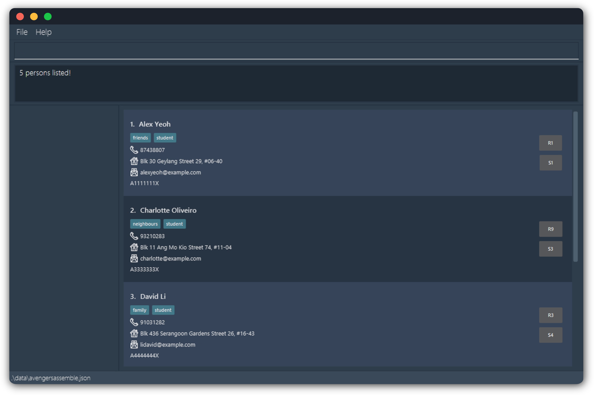
</p>

For more details on each parameter, [click here](#command-parameter-summary).

<br>

<div style="page-break-after: always;"></div>

<div id="copy"></div>

### Copying Contact Details : `copy`

Copies the emails of currently displayed persons into your clipboard.

**Format:** `copy`

<box type="info" seamless>

**Information:** <br>
* The emails copied into your clipboard will have semicolons separating them.
* Semicolons are used as delimiters to separate the emails when pasted into any email client.

</box>

<box type="tip" seamless>

**Tip:** <br>

* Use [`list`](#listing-all-persons--list) or [`find`](#filtering-persons--find) to get the list of people you would like to email.
* The emails are copied into your clipboard such that you may easily broadcast emails to specific groups of people.

</box>

> **Note:** The application ignores any extraneous parameters as we assume they are typos.

You will see this message once you have successfully copied the contact details shown to you, indicating that they have been copied to the clipboard:

<p align="center">
  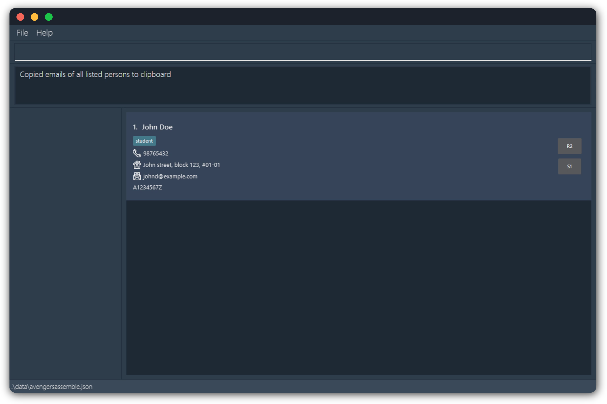
</p>

<br>

<div style="page-break-after: always;"></div>

<div id="export"></div>

### Exporting Data to a CSV File : `export`

Exports currently displayed persons and their details to a CSV file of your specification.

**Format:** `export`

> By default, the file will be stored in `addressbookdata/avengersassemble.csv`.

<box type="tip" seamless>

**Tip:**

You can specify the groups of contacts you want to export using the [`find`](#filtering-persons--find) or [`list`](#listing-all-persons--list) commands before you use this command.

</box>

<box type="warning" seamless>

**Caution:**

When performing an export, the current information will overwrite any existing CSV files with the same name.
If you want to preserve the exported data, you should rename it or save it in a separate location.

</box>

You will see this message once you have successfully exported the data:

<p align="center">
  
</p>

<br>

<div id="exit"></div>

### Exiting the Program : `exit`

Exits the program. The app will close automatically.

**Format:** `exit`

> **Note:** The application ignores any extraneous parameters as we assume they are typos.

<br>

--------------------------------------------------------------------------------------------------------------------

<div style="page-break-after: always;"></div>

<div id="exam-management-features"></div>

## Exam Management Features

These features are designed to help you manage exam scores for the persons in your contact list and consolidate all assesment data from canvas, edurec, and source academy.
You can import exam scores from CSV files generated by these platforms, manage the exam scores of each person in your contact list, and gather statistics on student performance.

<div id="importexamscores"></div>

### Importing Exam Scores from a CSV File : `importExamScores`

Imports all exam results from a CSV file.

**Format:** `importExamScores i|FILEPATH`

<box type="info" seamless>

**Information:**<br>

* The file path should be **absolute**.
* The `email` header **must** be the first column header.
* Exam names starting with `Exam:` e.g. if your exam is named `Midterms`, the column heading containing the scores for `Midterms` should be named `Exam:Midterms`.
* This command will only import scores if both the person and exam exists currently in Avengers Assemble. Use [`add`](#add) and [`addExam`](#addexam) to add persons and exams respectively.
* Duplicate exam headers in the CSV file will be ignored, with only the first occurrence being used.
* Each row following the header row corresponds to an individual's exam scores,
  with the first column containing the person's email address and the subsequent columns
  containing the scores for the exams as specified by the headers.
* Exam score values should be entered as decimal numbers within the valid score range (0 - maximum score),
  rounded to a maximum of 2 decimal places.

</box>

<box type="warning" seamless>

**Caution:**<br>

* Erroneous entries will be ignored, and the application will continue to import the rest of the data.
* This command will only import persons' exam scores. To import persons' particulars, take a look at [`import`](#importing-persons-from-a-csv-file--import)

</box>

**Example:** `importExamScores i|/Users/johansoo/Desktop/AvengersAssemble/exam_data.csv` <br>
imports exam results from the CSV file located at `/Users/johansoo/Desktop/AvengersAssemble/exam_data.csv`.

You will see this message once you have successfully imported the exam results:

<p align="center">
    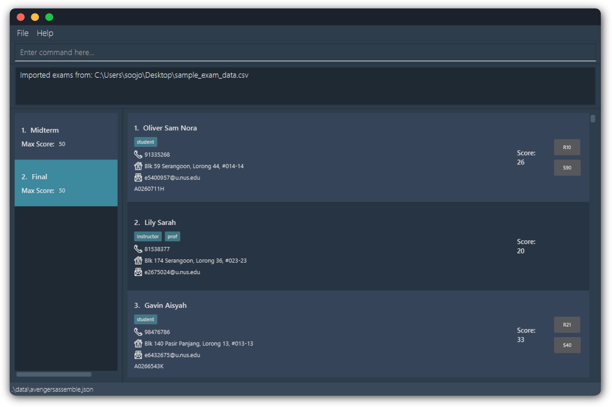
</p>

For more details on the parameter, [click here](#command-parameter-summary).

<br>

<div style="page-break-after: always;"></div>

<div id="addexam"></div>

### Adding an Exam : `addExam`

Adds an exam into your exam list.

**Format:** `addExam n|NAME s|MAX_SCORE`

<box type="info" seamless>

**Important:**

Each exam should have a unique name. Avengers Assemble does not allow for exams with duplicate names to be added.

</box>

**Example:** `addExam n|Midterm s|100` <br>
Adds an exam with the name "Midterm" and a max score of "100" into your exam list.

You will see this message once you successfully add an exam, including the details of the exam:

<p align="center">
  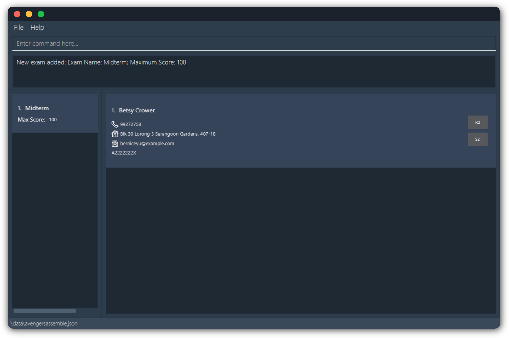
</p>

For more details on each parameter, [click here](#command-parameter-summary).

<br>

<div style="page-break-after: always;"></div>

<div id="deleteexam"></div>

### Deleting an Exam : `deleteExam`

Removes an exam from your exam list.

**Format:** `deleteExam INDEX`

<box type="info" seamless>

**Information:**

* Deletes the exam at the specified `INDEX`.
* When an exam is deleted, all corresponding records of scores associated with that exam will also be deleted.
* If the currently selected exam is deleted, it will be deselected.

</box>

**Example:** `deleteExam 3` <br>
Removes the third exam displayed in Avengers Assemble.

You will see this message once you have successfully deleted an exam, including the details of the exam you are deleting:

<p align="center">
  
</p>

<br>

<div style="page-break-after: always;"></div>

<div id="selectexam"></div>

### Selecting an Exam : `selectExam`

Selects an exam in your exam list.

**Format:** `selectExam INDEX`

<box type="info" seamless>

**Information:**

* Selects the exam at the specified `INDEX`.
* On selection, the exam will become highlighted on the user interface.
* Selecting an exam will display all scores of persons associated with that exam.

</box>

**Example:** `selectExam 1` <br>
Selects the first exam displayed on the exam list.

You will see this message once you have successfully selected an exam, including the details of the exam:

<p align="center">
    
</p>

<br>

<div style="page-break-after: always;"></div>

<div id="deselectexam"></div>

### Deselecting an Exam : `deselectExam`

Deselects your currently selected exam.

**Format:** `deselectExam`

You will see this message once you have successfully deselected an exam:

<p align="center">
    
</p>

<br>

<div style="page-break-after: always;"></div>

<div id="addscore"></div>

### Adding an Exam Score : `addScore`

Adds an exam score to a person at the specified index.

**Format:** `addScore INDEX s|SCORE`

<box type="info" seamless>

**Important: An exam must be selected for this command to work! You can use the [`selectExam`](#selectexam) command to do so.**

</box>

<box type="info" seamless>

**Information:**

* Adds an exam score to the person at the specific `INDEX`.
* The exam score added will correspond to the currently selected exam.
* The exam score added **cannot** be greater than the max score of the currently selected exam.
* The exam score will be displayed on the user interface only when the corresponding exam is selected.

</box>

**Example:** `addScore 1 s|42` <br>
Adds a score of 42 to the person currently displayed at index 1.

You will see this message once you successfully add a score, including the name of the person you added the score for:

<p align="center">
    
</p>

For more details on the parameter, [click here](#command-parameter-summary).

<br>

<div style="page-break-after: always;"></div>

<div id="editscore"></div>

### Editing an Exam Score : `editScore`

Edits a specified person's exam score.

**Format:** `editScore INDEX s|SCORE`

<box type="info" seamless>

**Information:**

* Edits the exam score of the person at the specific `INDEX`.
* A person **must** have an exam score for the currently selected exam for this command to work.
* The exam score edited corresponds to the currently selected exam.
* The exam score **cannot** be edited to be greater than the max score of the currently selected exam.

</box>

<box type="info" seamless>

**Important:**

An exam must be selected for this command to work! You can use the [`selectExam`](#selecting-an-exam--selectexam) command to do so.

</box>

**Example:** `editScore 1 s|25` <br>
Edits the score of the person currently displayed at index 1 to 25.

You will see this message once you successfully edit a score, including some details of the person you added the score for:

<p align="center">
    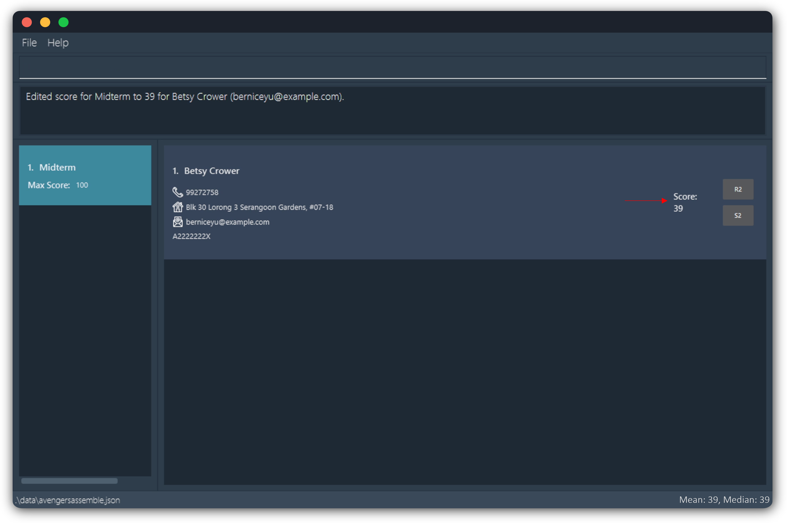
</p>

For more details on the parameter, [click here](#command-parameter-summary).

<br>

<div style="page-break-after: always;"></div>

<div id="deletescore"></div>

### Deleting an Exam Score : `deleteScore`

Deletes a specified person's exam score.

**Format:** `deleteScore INDEX`

<box type="info" seamless>

**Information:**

* Deletes the exam score of the person at the specific `INDEX`.
* A person **must** have an exam score for the currently selected exam for this command to work.
* The exam score deleted corresponds to the currently selected exam.

</box>

<box type="info" seamless>

**Important:**

An exam must be selected for this command to work! You can use the [`selectExam`](#selecting-an-exam--selectexam) command to do so.

</box>

**Example:** `deleteScore 1` <br>
deletes the score of the person currently displayed at index 1.

You will see this message once you have successfully deleted a score, including some details of the person you added the score for:

<p align="center">
    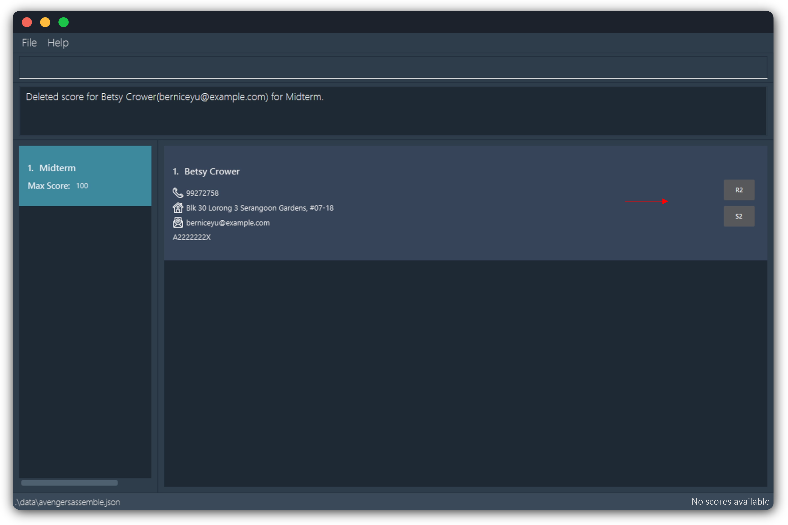
</p>

<br>

<div style="page-break-after: always;"></div>

<div id="mean-and-median"></div>

### Mean and Median of Exam Scores

You can view the mean and median of the scores of the exam currently selected at the bottom right of the application window.

<box type="info" seamless>

**Information:**

* When an exam is selected, the mean and median will automatically show up on the right of the footer of the application.
* The mean and median is calculated based on the currently filtered list of persons.
* If a person has no score for the selected exam, he is completely excluded from the calculation of mean and median.

</box>

When an exam is selected, the statistics will show on the bottom right of the application:

<p align="center">
    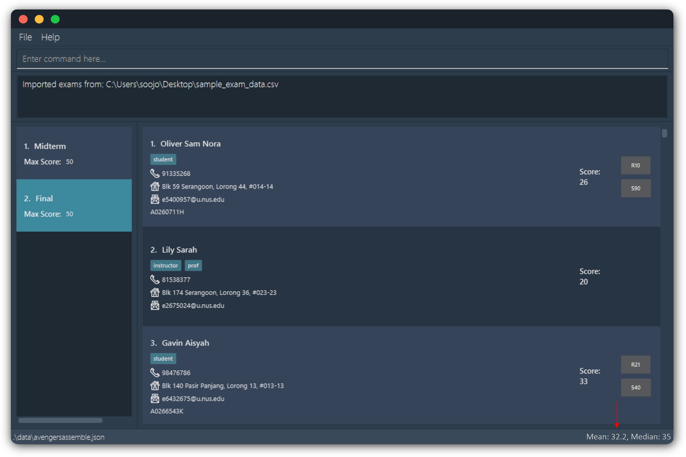
</p>

<br>

--------------------------------------------------------------------------------------------------------------------

<div style="page-break-after: always;"></div>

<div id="additional-information"></div>

## Additional Information

### Saving the Data

All data are saved in the hard disk automatically after any command that changes the data. There is no need to save manually.

### Editing the Data File

All data are saved automatically as a JSON file located at `[JAR file location]/data/avengersassemble.json` by default. You can update data directly by editing that data file if you are an advanced user.

<box type="warning" seamless>

**Caution:**
If your changes to the data file makes its format invalid, Avengers Assemble will discard all data and start with an empty data file at the next run.  Hence, it is recommended to take a backup of the file before editing it.<br/>
Furthermore, certain edits can cause the Avengers Assemble application to behave in unexpected ways (e.g., if a value entered is outside the acceptable range). Therefore, edit the data file only if you are confident that you can update it correctly.

</box>

<br>

--------------------------------------------------------------------------------------------------------------------

<div id="faq"></div>

## FAQ

**Q**: How do I transfer my data to another computer?<br>
**A**: Install the app in the other computer and overwrite the empty data file it creates with the file that contains the data of your previous AA home folder.

<br>

--------------------------------------------------------------------------------------------------------------------

<div id="known-issues"></div>

## Known Issues

### Using Multiple Screens

If you move the application to a secondary screen, and later switch to using only the primary screen, the GUI will open off-screen. The remedy is to delete the `preferences.json` file created by the application before running the application again.

### Importing on MacOS

On MacOS computers, due to privacy settings, the application may encounter difficulties accessing and importing CSV files from various locations.
If this issue occurs, transfer the CSV file you want to import to the same folder where the application's JAR file is located, then try again.

### Exporting Data on Initial Launch

Since the `export` function relies on data stored in your computer's hard disk, there might be some issues exporting it during the first launch of the application.
If you encounter this problem, you can resolve it by executing any other command (such as `list`) and then attempting the export again.

<br>

--------------------------------------------------------------------------------------------------------------------

<div style="page-break-after: always;"></div>

<div id="command-summary"></div>

## Command Summary

Below is a summary of the commands available in Avengers Assemble. Some examples are included for your convenience.

| Action                   | Format, Examples                                                                                                                                                                                                                                        |
|--------------------------|---------------------------------------------------------------------------------------------------------------------------------------------------------------------------------------------------------------------------------------------------------|
| **Help**                 | `help`                                                                                                                                                                                                                                                  |
| **Clear**                | `clear`                                                                                                                                                                                                                                                 |
| **Import**               | `import i\|FILEPATH` <br><br>• e.g. `import i\|C:/Users/alk/Downloads/avengersassemble.csv`                                                                                                                                                             |
| **Add**                  | `add n\|NAME p\|PHONE_NUMBER e\|EMAIL a\|ADDRESS [t\|TAG]… [m\|MATRICULATION_NUMBER] [s\|STUDIO] [r\|REFLECTION]​` <br><br>• e.g. `add n\|James Ho p\|22224444 e\|jamesho@example.com a\|123, Clementi Rd, 1234665 t\|friend t\|colleague m\|A1234567X` |
| **Edit**                 | `edit INDEX [n\|NAME] [p\|PHONE_NUMBER] [e\|EMAIL] [a\|ADDRESS] [t\|TAG]… [m\|MATRICULATION_NUMBER] [s\|STUDIO] [r\|REFLECTION]​` <br><br>• e.g.`edit 2 n\|James Lee e\|jameslee@example.com m\|A1234567X`                                              |
| **Delete**               | `delete INDEX` <br><br>• e.g. `delete 3`                                                                                                                                                                                                                |
| **Delete Shown Persons** | `deleteShown`                                                                                                                                                                                                                                           |
| **List**                 | `list`                                                                                                                                                                                                                                                  |
| **Find**                 | `find PREFIX\|KEYWORD` <br><br>• e.g. `find n\|James`                                                                                                                                                                                                   |
| **Copy**                 | `copy`                                                                                                                                                                                                                                                  |
| **Export to CSV**        | `export`                                                                                                                                                                                                                                                |
| **Exit**                 | `exit`                                                                                                                                                                                                                                                  |
| **Import Exam Scores**   | `importExamScores i\|FILEPATH` <br><br>• e.g. `importExamScores i\|C:/Users/alk/Downloads/exam_scores.csv`                                                                                                                                              |
| **Add Exam**             | `addExam n\|NAME s\|MAX_SCORE` <br><br>• e.g. `addExam n\|Midterm s\|100`                                                                                                                                                                               |
| **Delete Exam**          | `deleteExam INDEX` <br><br>• e.g. `deleteExam 3`                                                                                                                                                                                                        |
| **Select Exam**          | `selectExam INDEX` <br><br>• e.g. `selectExam 1`                                                                                                                                                                                                        |
| **Deselect Exam**        | `deselectExam`                                                                                                                                                                                                                                          |
| **Add Exam Score**       | `addScore INDEX s\|SCORE` <br><br>• e.g. `addScore 1 s\|42`                                                                                                                                                                                             |
| **Edit Exam Score**      | `editScore INDEX s\|SCORE` <br><br>• e.g. `editScore 1 s\|25`                                                                                                                                                                                           |
| **Delete Exam Score**    | `deleteScore INDEX` <br><br>• e.g. `deleteScore 1`                                                                                                                                                                                                      |


<br>

--------------------------------------------------------------------------------------------------------------------

<div style="page-break-after: always;"></div>

<div id="command-parameter-summary"></div>

## Command Parameter Summary

Some commands require you to include parameters. These parameters are identified by prefixes. Here are a list of valid prefixes and what they each refer to.

<box type="info" seamless>

**Important:** </br>

* Words in `UPPER_CASE` are the parameters to be supplied by you.<br>
    > e.g. in `add n|NAME`, `NAME` is a parameter which can be used as `add n|John Doe`.

* Prefixes encased with '[ ]' are optional.
    > e.g. `n|NAME [t|TAG]` can be used as `n|John Doe t|friend` or as `n|John Doe`.

* Prefixes with '…' after them can be used multiple times.
    > e.g. `[t|TAG]…​` can be used as ` ` (i.e. 0 times), `t|friend` (i.e 1 time), `t|friend t|family` etc.

* Parameters can be in any order.<br>
    > e.g. if the command specifies `n|NAME p|PHONE_NUMBER`, `p|PHONE_NUMBER n|NAME` is also acceptable.

* Extraneous parameters for commands that do not take in parameters (such as `help` , `list`, `exit`, `copy`, `export` and `clear`) will be ignored.<br>
    > e.g. if the command specifies `help 123`, it will be interpreted as `help`.

</box>

<box type="warning" seamless>

**Caution:** </br>
* If you are using a PDF version of this document, be careful when copying and pasting commands that span multiple lines as space characters surrounding line-breaks may be omitted when copied over to the application.
* Note the same prefix may be used for different purposes such as in the case of `s|` for studios and for scores. In these cases, we ensure no command would have to use the same prefix for multiple purposes.

</box>

| Prefix | What it refers to           | Max. Length    | Constraints    |
|--------|-----------------------------|----------------|----------------|
| n\|    | Name                        | 80             | Should only contain alphanumeric characters, spaces, and the characters `,`, `-`, `.`, `/`, `(` and `)`.                                                                                                                                                                                                                                                                                                                                                                                                                                                  |
| n\|    | Exam Name                   | 30             | Should only contain alphanumeric characters and spaces.                                                                                                                                                                                                                                                                                                                                                                                                                                                                                                   |
| p\|    | Phone Number                | 30             | It can start with an optional `+` to indicate the country code, with the rest only containing numbers. It should be at least 3 digits long.                                                                                                                                                                                                                                                                                                                                                                                                               |
| e\|    | Email                       | 100            | **Format:** local-part@domain<br/> **Constraints for local part:**<br/> • Should only contain alphanumeric characters, and the characters `+`, `_`, `.` and `-`.<br/> • Should not start or end with special characters.<br/> • Should not have two consecutive special characters.<br/> **Constraints for domain:**<br/> • Made up of domain labels seperated by periods.<br/> • Must end with a domain label of at least 2 characters long.<br/> • Domain label should consist of alphanumeric characters separated only by singular hyphens, if any.   |
| a\|    | Address                     | 100            | Can take any values.                                                                                                                                                                                                                                                                                                                                                                                                                                                                                                                                      |
| i\|    | Path of CSV file to Import  | -              | Should be the absolute file path of the CSV file.                                                                                                                                                                                                                                                                                                                                                                                                                                                                                                         |
| [m\| ] | Matriculation ID            | Fixed at 9     | The first letter must be an uppercase 'A', followed by 7 numbers, and end with an uppercase letter.                                                                                                                                                                                                                                                                                                                                                                                                                                                       |
| [r\| ] | Reflection Group            | 4              | The first letter must be an uppercase 'R', followed by any number.                                                                                                                                                                                                                                                                                                                                                                                                                                                                                        |
| [s\| ] | Studio Group                | 4              | The first letter must be an uppercase 'S', followed by any number.                                                                                                                                                                                                                                                                                                                                                                                                                                                                                        |
| [s\| ] | Score                       | 7 + 2 decimals | For Exam Max Scores: the input must be a positive integer.<br/> For Persons' Exam Scores: the input must be an integer greater than or equal to zero.                                                                                                                                                                                                                                                                                                                                                                                                     |
| [t\| ]…| Tags                        | 100            | Should be alphanumeric, and should not contain spaces.                                                                                                                                                                                                                                                                                                                                                                                                                                                                                                    |
| [lt\| ]| Less Than                   | 7 + 2 decimals | Should be a positive numerical value smaller than the currently selected Exam's Max Score.                                                                                                                                                                                                                                                                                                                                                                                                                                                                |
| [mt\| ]| More Than                   | 7 + 2 decimals | Should be a positive numerical value smaller than the currently selected Exam's Max Score.                                                                                                                                                                                                                                                                                                                                                                                                                                                                |
